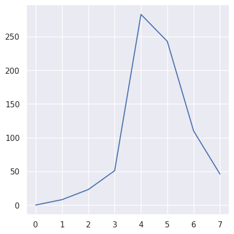

---
# Do not edit the text between these lines!
layout: default
---

# EX09 - Survey Analysis

<!-- This is a comment. Below, you'll see code for inserting an image. To make this image appear, update <custom-path>. To add an image, save it inside the imgs folder of this repository. -->
/static/imgs/logo.png" alt="Image of Comp110 rainbow logo. "  width="500"/>

## Classroom Learning Setting

One of the big questions about teaching is what teaching method would be best for their student's education. Is it a faster pace? Lots of homework questions? Less readings and more hands-on practice? All of these are valid questions, and questions obviously want answers.

One of our questions was whether students actually learn from the current classroom style. The classroom currently relies on a quick explanation of the fundamentals and logistics of how code works, and then going through an example of the code step-by-step.

So, we hypothesized that the course would benefit from spending more time on explaining the fundamentals and layouts of a type of code instead of focusing on going through exercises step-by-step to give more time for information to sink in and give a strong foundation for students.

### Analysis

The first question we need to ask is how well students find themselves doing in the current class setting. We can analyze this as a combination of the two classrooms.

First, we focus on the pace of the class.

*insert pace linegraph*

We see that there is an uneven distribution, where most students rank the class moving at a speed between 4 and 5.

Next, we analyze how difficult students find the material to be.

*insert difficulty linegraph*

So, students definitely find COMP 110 to be slightly on the challenging side. Theoretically, the combination of a higher difficulty class and quicker pace would lead to a student feeling behind or possibly lost. But we need to check this assumption.

Let's see if students have a good understanding of coding.

*insert understanding linegraph*

So the assumption above is wrong! Students actually have a decent understanding of the material. So, students must be seeking help and going to office hours since the class is on the more difficult side.

*insert office hour scatterplot and effectiveness scatterplot*

While students find office hours effective, they aren't really attending office hours based on the steep drop-off in the first graph. So, what's helping them with their understanding of computer science?

Maybe a lot of students actually had some form of experience before college?

*insert prior exp scatterplot*

Wow! So most students actually don't have much prior Python experience.

Maybe students are spending a lot of time on coding by teaching themselves and studying? Unfortunately, there isn't a survey question that specifically asked how much time students spend on COMP 110 alone, but maybe we can get some insight by seeing if students find the post-lesson questions and exercises effective.

*insert programming and lsqs bargraphs*

Okay, so students actually find hands-on practice to be more beneficial than hypothesized! It seems that the current classroom style is actually preferred and allows students to better understand coding.

### Conclusion

Our analysis of the hypothesis "students would prefer spending more time on the fundamentals in class rather than focusing on several practice problems" is actually disproven by the data collected. While students find the class difficult and a little speedy, students say they have a decent understanding of the material. Therefore, they must be getting their knowledge from a specific source. It was discovered that it wasn't office hours because students rarely attend, and most students don't have any prior experience with coding. So, our last source would be the post-lesson questions and programming exercises, which students find very effective in their learning. Changing the learning style of the classrom would actually be detrimental to the students leraning, which is obviously not ideal. This proposed change at the beginning of this analysis might even cause quiz scores to drop and overall grades to lower. Therefore, the proposed change should NOT be followed.

While some data from the survey is missing, like questions about sutdents' specific learning methods for the class and how much time is truly spent on studying and practice for COMP 110 alone, I do believe the data is conclusive enough to assume the teaching styles should not change. Seeing how much students value pracice, maybe it would be a good idea to switch to T/Th classes to allow for more time towards the end of class for follow-along practice problems. Office hours are limited to one question per student per hour, and tutoring only lasts for two hours on specific days. So, perhaps having longer class times spent on a topic with multiple practice problems will allow for students to get more feedback and become more comfortable with asking questions. Maybe even a recitation would be beneficial so students have a specific block of time dedicated to computer science and guarentees time that isn't interfering with any other *responsibilities*. But that would be another survey question that needs to be asked.

Overall, our findings are refuted by the data, but it's not an upsetting find. Hopefully, this will lead to a better understanding of what students find useful for their learning.