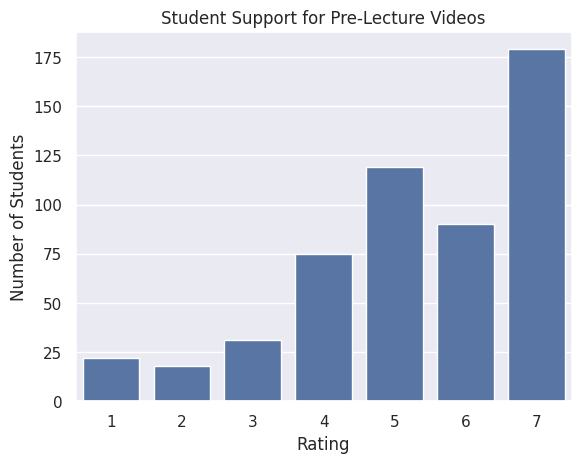
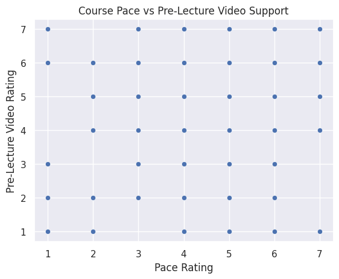

---
# Do not edit the text between these lines!
layout: default
---

# EX09 - Survey Analysis

Website Author: Abigail Wilson

## COMP 110 Layout

One of the big questions about teaching is what teaching method would be best for their student's education. Is it a faster pace? Lots of homework questions? Less readings and more hands-on practice? All of these are valid questions, and questions obviously want answers.

One of our questions was whether students are able to spend time preparing for the class material and get exposure to the topics beforehand, similar to a flipped-classroom teaching style. The class currently relies on a professor teaching all of the material and students doing post-lesson questions and exercises outside of class.

So, for students to get some exposure to these topics beforehand, we hypothesized that the course would benefit from having pre-lecture videos that allow for students to get an understanding of what they will learn the next day or for the week.

### Analysis

First, let us identify whether students would actually prefer to have pre-lecture videos in the first place, similar to how there used to be pre-lecture readings occasionally.

This bar graph shows that students would prefer to have pre-lecture videos. This is shown by the high number of ratings between 5-7 (7 being strongly agree), indicating that a majority of students believe pre-lecture videos would be helpful. With this, we can assume there is an overall strong support for adding pre-lecture videos in the future.

Next, let us see if there is a reason why students would prefer having these pre-lecture videos. We shall check this by looking at the data for how students rate the difficulty of the class.

This graph compares the course difficulty with the support for pre-lecture videos. Students who rated the course higher in difficulty tend to also give higher ratings for pre-lecture videos. So, we can assume there is a correlation between students who struggle more with the material are more likely to find pre-lecture videos beneficial to their learning.

Finally, let us look at how fast students believe the course is progressing, as this might also lead to a higher preference for pre-lecture videos.

This chart shows the relationship between course pace and support for pre-lecture videos. There is a pattern where students who rate the course progression as faster tend to give higher ratings for pre-lecture videos. This shows that pre-lecture videos may help students keep up with the material in a faster-paced course.

### Conclusion

Our analysis of the hypothesis that "COMP 110 should add optional pre-lecture videos because it will help students preview challenging material before class and improve understanding" is proven to be a beneficial idea. With the data shown in the tables, they demonstrate that there is a strong correlation between students who find the class to be at a quicker pace and higher difficulty would prefer to have pre-lecture videos for the topic about to be discussed in class. Allowing for these optional videos would act as a resource for students to improve their understanding, look back at for reference during studying, and may increase their performance overall.

One potential trade-off of creating these pre-lecture videos is that they require additional time and effort from those recording them, specifically professors and teaching assistants. However, if the videos recorded are shorter and are able to act more as a resource rather than replacing in-class teaching, they could provide significant value to students without the students or the ones recording them to feel overwhelmed. While making these videos as a one-time occurrence, they can still be used over and over again for future classes.

Overall, the evidence from the class survey suggests that pre-lecture videos would be a useful addition to the COMP 110 course, and would help with the students understanding of the material.